# docker部署开源企业级VPN-AnyLink及安装配置

> `AnyLink`是一个企业级远程办公`ssl vpn`软件，可以支持多人同时在线使用。基于`openconnect`协议开发，并且借鉴了`ocserv`的开发思路，可以完全兼容`AnyConnect`客户端。`AnyLink`使用`TLS/DTLS`进行数据加密，因此需要`RSA`或`ECC`证书，可以通过`Let's Encrypt`或自签证书。

## 个人看中特色

1. `AnyLink`最主要的功能莫过于<span style="color: red; font-weight: bold;">用户分组功能</span>。通过设置分组权限可以使不同用户或员工能访问的网段和路由也不同。
2. `AnyLink`支持`SMTP`邮件来分发密码，同时也支持`TOTP`动态令牌，确实更适合小型企业的远程访问管理。但是并不能像`OpenConnect VPN`一样支持证书登录，所以每次连接都需要手动输入密码（使用`AnyClient`客户端可以记住密码）。
3. `AnyLink`提供后台管理界面，傻瓜式操作，甚至可以可以集成到自动流程中，因为他有后台管理页面，可以通过分析他的`API`接口。

*注意：任何`VPN`软件都避免不了**横向移动或“跳板行为”**，虽然`AnyLink`能够控制VPN客户端的初始访问权限，但无法防止用户登录到内网A机器后，通过A机器再ssh到B、C等其它内网机器。*

## 项目地址

* [Gitee/bjdgyc/anylink](https://gitee.com/bjdgyc/anylink)
* [Github/bjdgyc/anylink](https://github.com/bjdgyc/anylink)

## 服务端安装

我这里的Linux是`CentOS`系列的。

### 1. 准备条件

* 系统需先安装好`Docker`和`docker-compose`环境。
* 建议准备独立域名，方便申请SSL证书。

### 2. 下载镜像

```shell
docker pull registry.cn-hangzhou.aliyuncs.com/bjdgyc/anylink:latest && \
docker tag registry.cn-hangzhou.aliyuncs.com/bjdgyc/anylink:latest bjdgyc/anylink:latest && \
docker rmi registry.cn-hangzhou.aliyuncs.com/bjdgyc/anylink:latest && \
docker images | grep -i "bjdgyc/anylink"
```
### 3. 准备目录

所有的配置文件、日志都放在`/opt/anylink`目录下，所以需要提前创建好这个目录。

```shell
mkdir -p /opt/anylink && cd /opt/anylink
```

### 4. 生成密码和`jwt secret`

首次运行以下命令来创建管理员密码，以下命令中含`rm`参数么，仅用于执行创建密码的命令，会自行删除，将生成的`Passwd`和`secret`保存。

```shell
read -sp "请输入管理员密码：" user_passwd && echo && echo "明文密码: $user_passwd" >> passwd.txt && docker run -it --rm bjdgyc/anylink tool -p $user_passwd | sed 's/Passwd:/密文密码: /' >> passwd.txt && docker run -it --rm bjdgyc/anylink tool -s | sed 's/Secret:/Secret: /' >> passwd.txt && cat passwd.txt
```

输入密码的过程中不会显示，输入完成后回车即可。

### 5. 获取配置目录

复制以下命令，拷贝配置文件到宿主机后删除容器。

```shell
docker run --name temp-anylink --rm -d bjdgyc/anylink && docker cp temp-anylink:/app/conf . && docker stop temp-anylink
```

### 6. 配置文件调整

将`docker cp`拷贝出来的`conf`目录中的`server.toml`，进行修改，根据自己熟悉的编辑器打开。下面列举了主要配置的介绍。

#### 6.1. 数据存储方式（可选）

`db_type`的默认值为`sqlite3`，表示使用`sqlite3`数据库，也可以改为`mysql`，但是需要提前创建好数据库。

#### 6.2. 证书文件（建议）

使用`Let's Encrypt`申请免费的SSL证书，如果有使用面板工具，有一些面板工具提供了自动续期和推送到指定目录。如果没有使用面板工具，`Linux`有`certbot`管理工具。

#### 6.3. 日志文件（可选）`

如果要启用记录日志，`log_path`必须要写决定路径，否则`AnyLink`不会生成日志文件。

```toml
log_path = "/app/log"
log_level = "debug"
```

#### 6.4. 修改issuer（建议）

`issuer`表示`AnyLink`后台管理页面的标题，建议修改为公司名称。

```toml
issuer = "小明科技VPN"
```

#### 6.5. 修改管理员账户（建议）

`admin_user`默认为`admin`，建议修改为其他的。

```toml
admin_user = "xiaoming"
```

#### 6.6. 修改密码（必改）

把[生成密码和jwt secret](#4-生成密码和jwt-secret)步骤生成的密文密码替换在`admin_pass`参数中。


```toml
admin_pass = "$2a$10$e7r/iLzMll6b1GxPUEH82.5og4D1a2uidFfR9Y.GTEQ.fVbpr8l3m"
```

#### 6.7. 开启otp（可选）

根据需要是否开启后台管理账户的`otp`功能，如果要启用，需要修改`admin_otp`参数。我这里不开启了。

#### 6.8. 修改jwt（必改）

把[生成密码和jwt secret](#4-生成密码和jwt-secret)步骤生成的`Secret`替换在`jwt_secret`参数中。

```toml
jwt_secret = "VaJRbdHsE6NfE-xj4mf7OfuokoG_VzCl7WXQ6AJF_bV2Fyl7LWPWThc"
```

#### 6.9. 修改TCP监听端口（可选）

`server_addr`默认为`:443`，表示监听`443`端口，如果要监听其他端口，比如要监听`8443`端口，那么修改`server_addr`参数为`:8443`。

```toml
server_addr = ":8443"
```

#### 6.10. 修改DTLS（可选）

如果选择：`true`开启，则`dtls`端口建议和`tcp`业务端口一致。

```toml
#开启 DTLS
server_dtls = true
#UDP监听地址
server_dtls_addr = ":8443"
```
#### 6.11. 修改控制台端口（可选）

```toml
admin_addr = ":8800"
```

#### 6.12. tcp代理协议（可选）

保持默认即可，这个功能猜测是为了日志审计用的

```toml
proxy_protocol = false
```

#### 6.13. 客户端虚拟IP（可选）

默认是`192.168.90.0/24`，如果和内网冲突请修改，docker部署时网卡一般都是`eth0`。

#### 6.14. 压缩（可选）

开启压缩可以节省带宽和加快传输速度，网络延迟大网络带宽小建议开启，但开启会增加服务器的 CPU 负载，因为压缩和解压缩操作需要额外的计算资源。

```toml
compression = false
no_compress_limit = 256
```

#### 6.15. 客户端显示详细错误信息（可选）

线上环境慎开启。

```toml
display_error = true
```

#### 6.16. 完整的`server.toml`配置

`sudo vim ./conf/server.toml`

```toml
#数据文件
db_type = "sqlite3"
db_source = "./conf/anylink.db"

#证书文件
#cert_file = "./conf/vpn_cert.pem"
#cert_key = "./conf/vpn_cert.key"
cert_file = "./conf/fullchain.pem"
cert_key = "./conf/privkey.pem"
files_path = "./conf/files"


#日志目录,默认为空写入标准输出
log_path = "/app/log"
log_level = "debug"

#系统名称
issuer = "小明科技VPN"
#后台管理用户
admin_user = "xiaoming"
#pass 123456
admin_pass = "$2a$10$e7r/iLzMll6b1GxPUEH82.5og4D1a2uidFfR9Y.GTEQ.fVbpr8l3m"
# 留空表示不开启 otp, 开启otp后密码为  pass + 6位otp
# 生成 ./anylink tool -o
admin_otp = ""
#jwt_secret = "abcdef.0123456789.abcdef"
jwt_secret = "VaJRbdHsE6NfE-xj4mf7OfuokoG_VzCl7WXQ6AJF_bV2Fyl7LWPWThc"

#TCP服务监听地址(任意端口)
server_addr = ":8443"
#开启 DTLS
server_dtls = false
#UDP监听地址(任意端口)
server_dtls_addr = ":8443"
#后台服务监听地址
admin_addr = ":8800"

#最大客户端数量
max_client = 200
#单个用户同时在线数量
max_user_client = 3

#虚拟网络类型[tun macvtap]
link_mode = "tun"
#客户端分配的ip地址池
#docker环境一般默认 eth0，其他情况根据实际网卡信息填写
ipv4_master = "eth0"
ipv4_cidr = "192.168.90.0/24"
ipv4_gateway = "192.168.90.1"
ipv4_start = "192.168.90.2"
ipv4_end = "192.168.90.250"

#是否自动添加nat
iptables_nat = true

#客户端显示详细错误信息(线上环境慎开启)
display_error = true

#启用压缩
compression = true
#低于及等于多少字节不压缩
no_compress_limit = 256
```

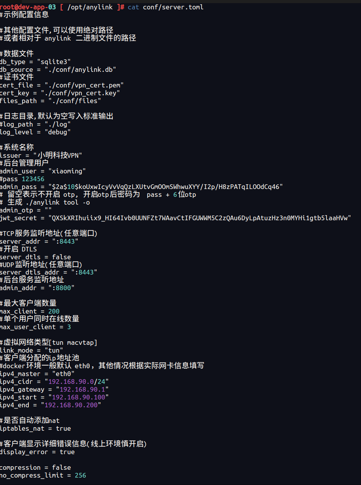

### 7. 生成docker-compose配置文件

如果没有安装`docker-compose`，也可以用`docker`命令启动。

```shell
docker run -d --name xiaoming-anylink --restart always --privileged true -p 8443:8443 -p 8443:8443/udp -p 8800:8800 -v /app/log:/opt/anylink/log -v /app/conf:/opt/anylink/conf bjdgyc/anylink -c=/app/conf/server.toml
```

更加推荐使用`docker-compose`，配置信息保存在`docker-compose.yaml`文件中。其内容为：

```yaml
version: "3.9"
services:
  anylink:
    image: bjdgyc/anylink:latest
    container_name: xiaoming-anylink
    restart: always
    privileged: true
    ports:
      - "8443:8443"
      - "8443:8443/udp"
      - "8800:8800"
    volumes:
      - "./conf:/app/conf"
      - "./log:/app/log"
      - "/dev/net/tun:/dev/net/tun"
    command:
      - --conf=/app/conf/server.toml
    cap_add:
      - NET_ADMIN
    deploy:
      resources:
        limits:
          cpus: "1.0"
          memory: "1GB"
```

然后用命令`docker-compose up -d && docker-compose logs -f`启动并查看日志。

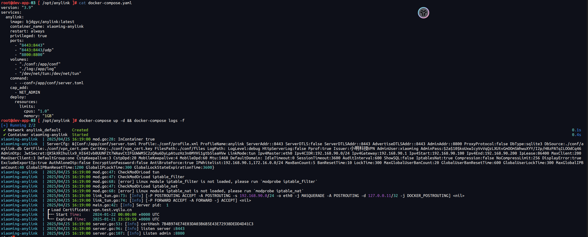

## 8. 管理控制台

如果你是部署在云服务器上，一般云服务器有**安全组**的概念，你需要把**8443**端口开放出来，否则无法访问。如果有公网IP则用公网IP,如果没有则用内网IP。在浏览器中输入`https://IP:8800`，注意必须输入`https`，然后输入前面配置文件中配置的管理员账户`xiaoming`，密码就是之前的明文密码，在`/data/anylink/passwd.txt`。

如果不小心忘记输入`https`，则页面浏览器显示`Client sent an HTTP request to an HTTPS server.`：

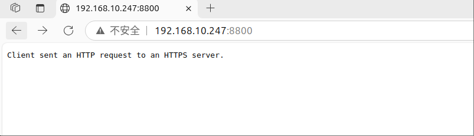

如果你并没有更换证书，那么浏览器会提示`你的连接不是专用连接`，只需要点击**高级**按钮，然后点击**继续访问**即可。

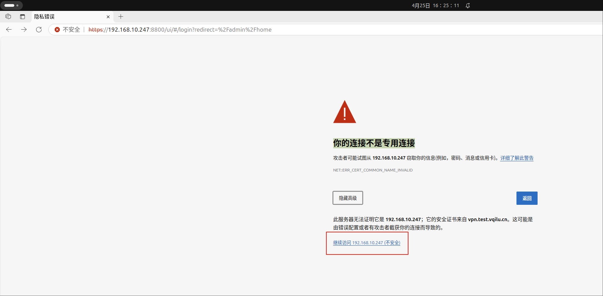

后台管理非常简单明了，只需要配置`用户组`和`用户`即可开始使用，其他按需定制即可。

### 8.1. 邮件配置（可选）

如果需要使用邮件分发密码和`OTP`，则必须配置邮件服务器，点击左侧菜单列表的`基础信息` → `其他设置` → `邮件设置`：

比如要截图中采用的是QQ邮箱，那需要找到[QQ邮箱 SMTP/IMAP服务](https://wx.mail.qq.com/list/readtemplate?name=app_intro.html#/agreement/authorizationCode)

| 名称      | 值          |
|----------|-------------|
| 服务器地址 | smtp.qq.com |
| 服务器端口 | 465         |
| 用户名    | 你的QQ邮箱    |
| 密码      | 临时授权吗    |
| 加密类型  | SSLTLS       |

### 8.2. 其他设置（可选）

点击左侧菜单列表的`基础信息` → `其他设置` → `其他设置`，可以配置`Banner信息`、`自定义首页（支持HTML代码）`、`邮件分发模`版等，可以根据自己的需求修改。

### 8.3. 用户组的配置

点击左侧菜单列表的`用户组信息` → `用户组列表`，默认情况下如下：

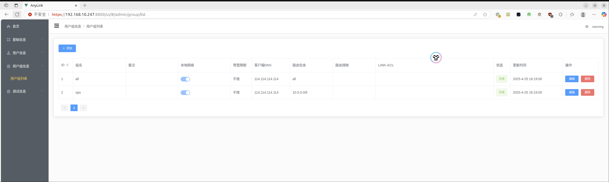

> 不用的用户组可以仅用或者删除，以免客户端显示太多。

#### 8.3.1. 添加用户组

点击`添加`按钮，会弹出对话框。

##### 8.3.1.1. 通用

这部分必须关注的是`组名`，可以是中文名，也可以是英文名，但不能重复，否则会报错。

`宽带限制`默认为`0`，这个按需更改把。

`客户端DNS`按需改动，默认是`114.114.114.114`，我一般习惯改为`223.5.5.5`和`223.6.6.6`。

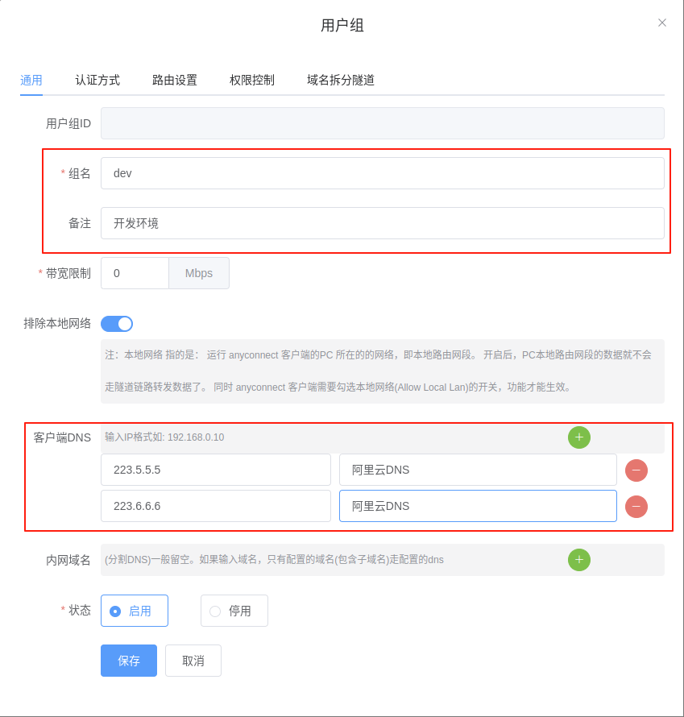

##### 8.3.1.2. 认证方式

默认即可，无需修改。

##### 8.3.1.3. 路由设置

`包含路由`如果添加内网网段，例如网段为`10.0.0.0/24`，则表示该组用户可以访问内网设备，而互联网请求依旧使用客户端本地的网络访问。

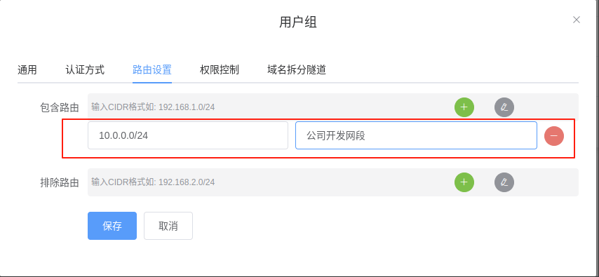

##### 8.3.1.4. 权限控制

默认即可，无需修改。

##### 8.3.1.5. 域名拆分隧道

默认即可，无需修改。

### 8.4. 用户的配置

点击左侧菜单列表的`用户信息` → `用户列表` → `添加`按钮。`PIN码`就是密码，如果不填写就是系统随机生成。`禁用OTP`默认是不开启的，建议开启这个功能，提高VPN的安全性。 `用户组`必须勾选一个，也可以勾选多个，但是客户端每次连接只能选择一个组。`发送邮件`的启用并生效的前提必须先配置邮箱服务器。

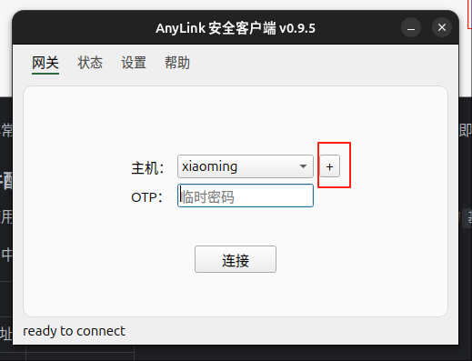

## 9. 客户端

经过我个人使用经验，首推[AnyLink Clint](https://github.com/tlslink/anylink-client)，`Cisco Secure Client`、`OpenConnect`都存在一些小问题，比如`Cisco Secure Client`不支持`OTP`动态码；`OpenConnect`用起来比较麻烦，也记不住配置等。

好心人事已经做了一个[网页（国内可访问）](https://ocserv.yydy.link:2023/#/)，其中还包括了`OTP`的软件下载。如果无法下载`Google Authenticator`，可以选择使用`Microsoft Authenticator`，甚至如果你在用密码管理器，部分软件已经内置了该功能。

我这里演示了以`AnyLink`客户端的使用过程。

## 9.1. 新建Profile管理


## 9.2. 填写Profile管理信息

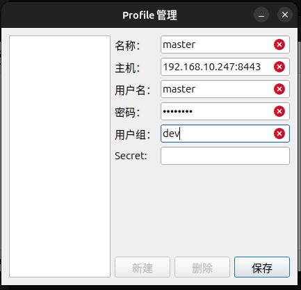

点击保存是会有一个安全提示，你的密码将会被保存。

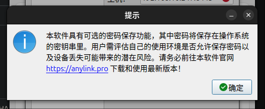

点击`保存`按钮，保存成功后。

## 9.3. 设置更改（可选）

如果采用的证书是不可信的，客户端默认是终止连接的，可以在`设置`中取消勾选。

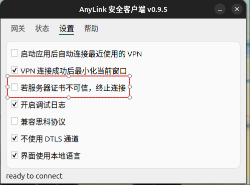

## 9.4. 连接

如果启用了`OTP`，则需要输入`OTP`的临时密码，然后点击`连接`按钮。

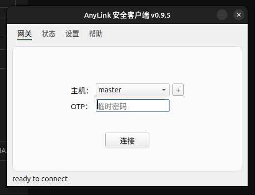

连接成功之后，默认会最小化成功，也可以在前面的设置中取消勾选`VPN连接成功后最小化当前窗口`。

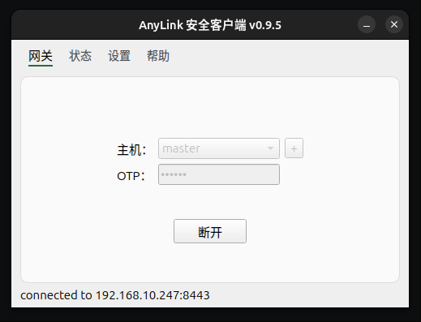

## 参考

* [docker部署开源企业级远程办公VPN及软件安装-AnyLink_](https://blog.quickso.cn/2025/02/11/docker%E9%83%A8%E7%BD%B2%E5%BC%80%E6%BA%90%E4%BC%81%E4%B8%9A%E7%BA%A7%E8%BF%9C%E7%A8%8B%E5%8A%9E%E5%85%ACVPN-%E5%8F%8A%E8%BD%AF%E4%BB%B6%E5%AE%89%E8%A3%85-AnyLink/#7-%E7%94%A8%E6%88%B7%E7%BB%84%E4%BF%A1%E6%81%AF)
* [VyOS 部署AnyLink](https://github.com/bjdgyc/anylink/issues/350)
